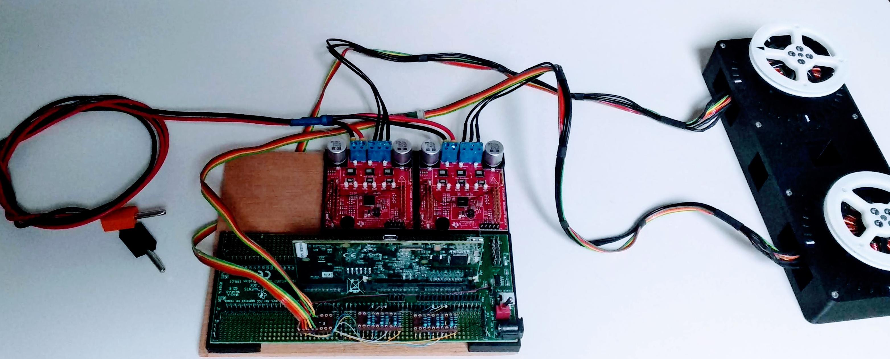
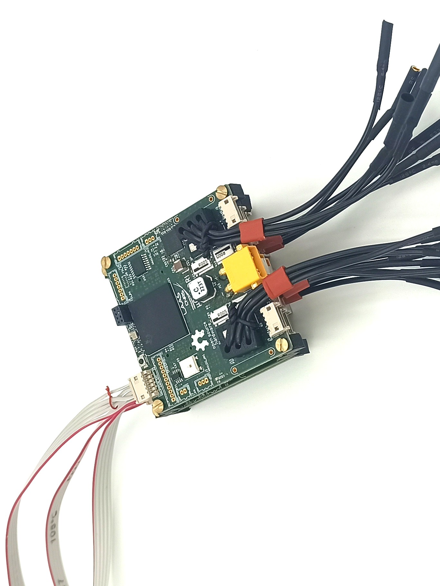

# open-motor-driver-initiative
Open-source driver for brushless motors, following the open dynamic robot initiative 

This contains hardware and firmware for several open source motor control boards all based around TMS320F2838x MCU from Texas Instrument. The boards are designed to perform sensored FOC control of PMSM and BMDC motors.
The goal of this is to provide an alternative to close-sourced industrial grade motor controller that doesn't allow custom control design low, custom communication buses and sensor integration, as well as an alternative to open source low-cost projects that make many compromises and limit their performance.

This should only be replicated for specific needs, where bandwidth, power computation or sensor integration are needed. Often off-shelf solutions offer easier and lower cost solution. 

The TMS320F2838x offer a high number of peripheral dedicated to motor control as well as a fair bit of computational power with 3 CPUs and hardware accelerators. It also offers a range of high bandwidth communication buses such as SPI, FSI, EtherCAT, USART, CAN-FD, Ethernet, USB V2, etc. that allow to implement custom network ideal for centralised robotic applications. 

The main motivation for those boards is for them to be integrated into legged robotics to do academic research. 

All the content of this repository is under BSD-3 Licence.

## Several motor control boards
Several boards are developed around the same system architecture to accommodate different needs. (Number of axis, power ranges, from factor etc.)
See below an overview of the boards

[Todo put picture of all the boards, basic specs and link to the relevant folder]

### Texas Instrument development boards
This setup used TI dev board and was used for first development, It's not a very practical design

### uOmodri (or udriverv3)
This board was design with to be backward compatible with the udriverv2 used in odri robots.

### uOmodri single axis
This board is a project not designed yet. It will be a single-axis version to be attached directly to motors from myactuator.com
### PAL Robotics MC21R01 
[to do]
